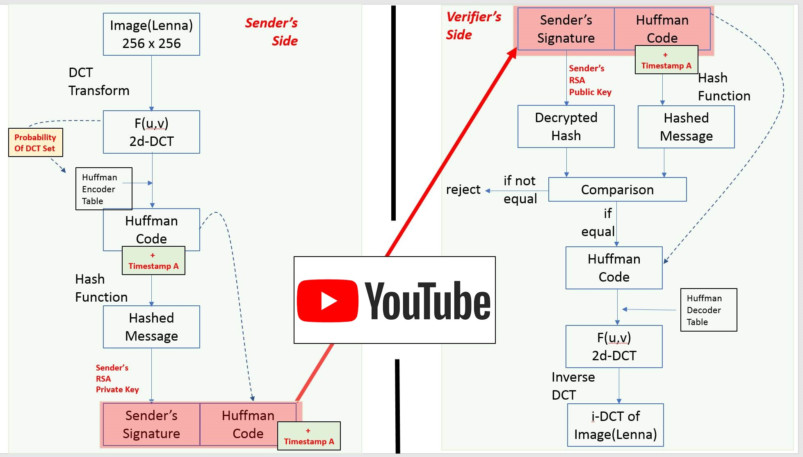
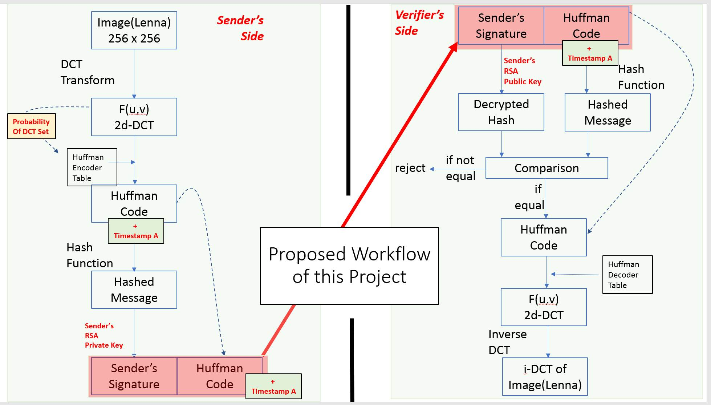

# RSA_DCT_HuffmanCoding
Topic : 
Image Encryption by RSA Algorithm upon Image Compression by DCT and Huffman Coding

--- --- --- ---

<a herf="https://youtu.be/VM4CL5XHZqI">https://youtu.be/VM4CL5XHZqI</a>

Commands for running the applications are :
- python SenderApp.py ; and
- python VerifierApp.py .

--- --- --- ---

For details , please refer to <a href="./CodingReport.pdf">CodingReport.pdf</a>

Twitter Discussion :
<a href="https://twitter.com/AlbertTsangPoly/status/1554570477414547456?s=20&t=dZ2fl5ynrexyImT1fglRnA">Index Terms — # Image Encryption. # Image Compression. # Huffman Coding. # RSA Algorithm @ AlbertTsangPoly </a>

